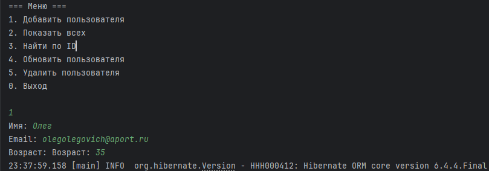
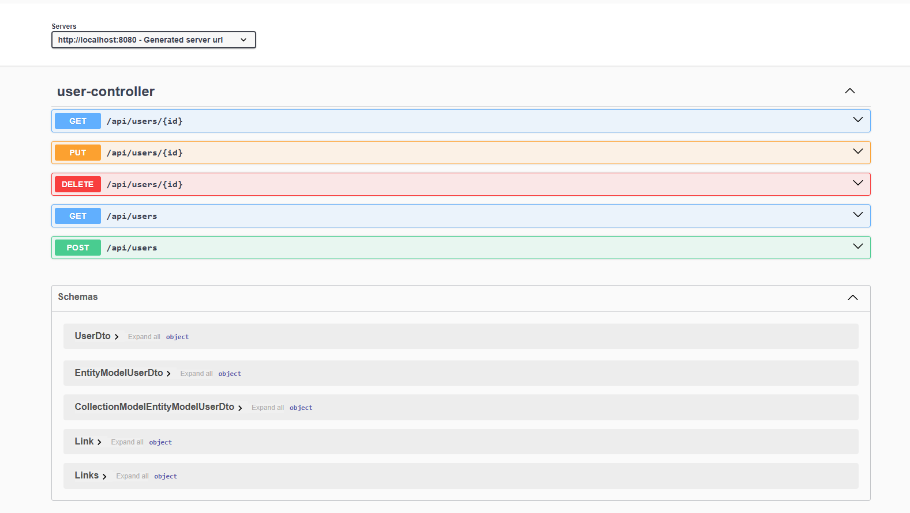

[](https://qlty.sh/gh/irinakomarchenko/projects/user-service)

# User Service 

**User Service** — консольное Java-приложение для управления пользователями с помощью Hibernate и PostgreSQL.  
Реализованы основные CRUD-операции (создание, чтение, обновление, удаление) через удобное меню.

---

## Технологии

- Java 22
- Hibernate ORM
- PostgreSQL (через Docker)
- SLF4J + Logback (логирование)
- JUnit 5 (тестирование)
- Maven (сборка и зависимости)
- Checkstyle (проверка стиля кода)

---

## Запуск проекта

### 1. Клонировать репозиторий

```sh
git clone https://github.com/ТВОЙ_ЛОГИН/user-service-hibernate.git
cd user-service-hibernate
```
### 2 Запустить базу данных PostgreSQL
```sh
docker compose up -d
```
### 3. Собрать проект и проверить стиль кода

```sh
mvn clean install
mvn checkstyle:check
```
### 4. Запустить тесты

```sh
mvn test
```
### 5. Формирование отчета о тестах

```sh
mvn verify
```

### 6. Запустить приложение


```sh
mvn exec:java -Dexec.mainClass="myuserservice.App"
```

### 7. Пример работы приложения


