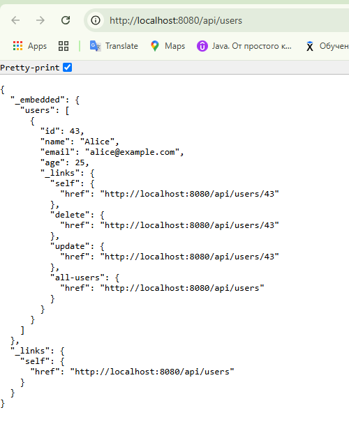

[](https://qlty.sh/gh/irinakomarchenko/projects/user-service-spring)

# User Service Spring

**User Service Spring** — REST API-сервис на Spring Boot для управления пользователями (CRUD).

---

## Технологии

- Java 22
- Spring Boot
- Spring Web (REST API)
- Spring Data JPA (встроенный Hibernate)
- PostgreSQL (через Docker Compose)
- Spring HATEOAS (hypermedia links в API)
- Swagger/OpenAPI (автоматическая документация)
- SLF4J + Logback (логирование)
- JUnit 5 + MockMvc (тестирование контроллеров и API)
- Maven (сборка и зависимости)
- Checkstyle (проверка стиля кода)
- Lombok — (автогенерации геттеров/сеттеров)
---

## Описание API и документация

### Swagger OpenAPI

В проект интегрирована автоматическая генерация документации с помощью **Swagger (OpenAPI)**.  
Документация доступна после запуска приложения:

- **Swagger UI:** [http://localhost:8080/swagger-ui/index.html](http://localhost:8080/swagger-ui/index.html)
- **OpenAPI JSON:** [http://localhost:8080/v3/api-docs](http://localhost:8080/v3/api-docs)

### Поддержка HATEOAS

Сервис реализует подход **HATEOAS** (Hypermedia as the Engine of Application State):

- Все ответы API содержат _hypermedia-ссылки_, помогающие навигировать по ресурсам (например, ссылки на просмотр, редактирование и удаление пользователя).
- Это упрощает клиентскую интеграцию и соответствует лучшим REST-практикам.

## Запуск проекта

### 1. Клонировать репозиторий

```sh
git clone https://github.com/ТВОЙ_ЛОГИН/user-service-hibernate.git
cd user-service-hibernate
```
### 2 Запустить базу данных PostgreSQL
```sh
docker compose up -d
```
### 3. Собрать проект и проверить стиль кода

```sh
mvn clean install
mvn checkstyle:check
```
### 4. Запустить тесты

```sh
mvn test
```
### 5. Формирование отчета о тестах

```sh
mvn verify
```

### 6. Запустить приложение


```sh
mvn clean package
java -jar target/user-service-spring.jar
```

### 7. Пример работы приложения


